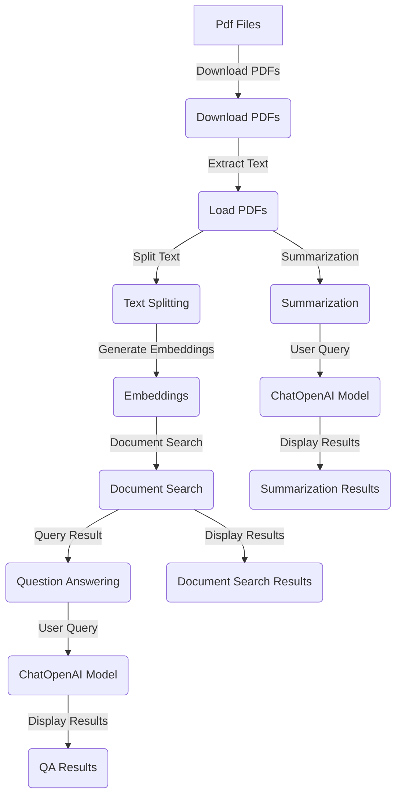

# Project Readme

## Overview

This project aims to facilitate the extraction and summarization of information from a collection of PDF documents related to the Rwanda Development Board (RDB). The provided scripts utilize langchain, a language processing library, for text extraction, querying, and summarization.

## Features

1. **PDF Download:** The `download_pdfs_from_website` script enables the downloading of PDFs from a specified website (`https://rdb.rw/` in this case) while avoiding certain URLs.

2. **Text Extraction:** The `load_pdfs_from_directory` script reads text content from PDF files in a specified directory using PyPDF2.

3. **Text Splitting:** The concatenated text from multiple PDFs is split into chunks using langchain's `CharacterTextSplitter`.

4. **Embeddings and Document Search:** OpenAI's language models are used for generating embeddings, and FAISS is employed for efficient document similarity search.

5. **Question Answering (QA):** The project supports QA capabilities using langchain's question-answering components.

6. **Summarization:** The ChatOpenAI model from langchain is utilized for document summarization based on user queries.

## Usage

1. **Setup:**
   - Install required dependencies: `pip install -r requirements.txt`
   - Set up OpenAI API key: `export OPENAI_API_KEY="YOUR_API_KEY"`

2. **Download PDFs:**
   - Modify `base_url` and `download_path` in `download_pdfs_from_website` script.
   - Execute the script: `python download_pdfs.py`

3. **Text Extraction and Processing:**
   - Use `load_pdfs_from_directory` to extract text from downloaded PDFs.

4. **Summarization:**
   - Modify the query in the `ChatOpenAI` script.
   - Execute the script: `python summarization.py`

5. **Question Answering:**
   - Modify the `query` in the question-answering script.
   - Execute the script: `python question_answering.py`

## Additional Notes

- Ensure proper handling of exceptions and error messages.
- Review and update file paths, API keys, and other configurations as needed.
- This project assumes Python 3.7 or later.

# PDF Processing Flow

## Sources

- [langchain Documentation](https://python.langchain.com/docs/get_started/introduction)
- [Chroma Documentation](https://docs.trychroma.com/getting-started)
- [Generative AI Document Summarization with Langchain](https://github.com/GoogleCloudPlatform/generative-ai/blob/main/language/use-cases/document-summarization/summarization_large_documents_langchain.ipynb)
- [A Step-by-Step Guide to PDF Chatbots with Langchain and Ollama](https://www.analyticsvidhya.com/blog/2023/10/a-step-by-step-guide-to-pdf-chatbots-with-langchain-and-ollama/)
